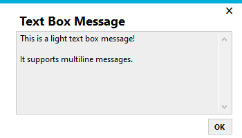

# Metro Framework Message Boxes
Message and input boxes for the [Metro Framework](https://thielj.github.io/MetroFramework/)

A library currently including a basic message box (either a label or a readonly text box) and a string input box.

# Usage
Below are guides on how to use the message boxes.

### Applies to all
Make sure you are including the MetroFrameworkMessageBoxes namespace:
```c#
using MetroFrameworkMessageBoxes;
```
Message box show functions have a theme argument.
There are currently two themes: Dark or Light.
```c#
MetroMessageTheme.Dark
MetroMessageTheme.Light
```

There is also an argument that allows you to specify an owner window. If you provide ```this``` for that argument, the window opening the message box will not be interactable while it is open.

### Message Box
To show the message box:
```c#
MetroMessage.Show("Message box title", "Message box text", MetroMessageTheme.Dark);
```
#### Appearance


### Text Box Message
To show the text box message:
```c#
MetroTextBoxMessage.Show("Message box title", "Message box text", MetroMessageTheme.Dark);
```
#### Appearance



### Input Box
To show the text box message:
```c#
string input; // String that the input will be copied to once the form is closed (via ok or otherwise)
DialogResult result; // How the form was closed (via ok, cancel or close button)

result = MetroInputForm.Show("Input box title", out input, MetroMessageTheme.Light);

if (result == DialogResult.OK)
  // Do something with the input
else
  // User cancelled the input
```
#### Appearance


